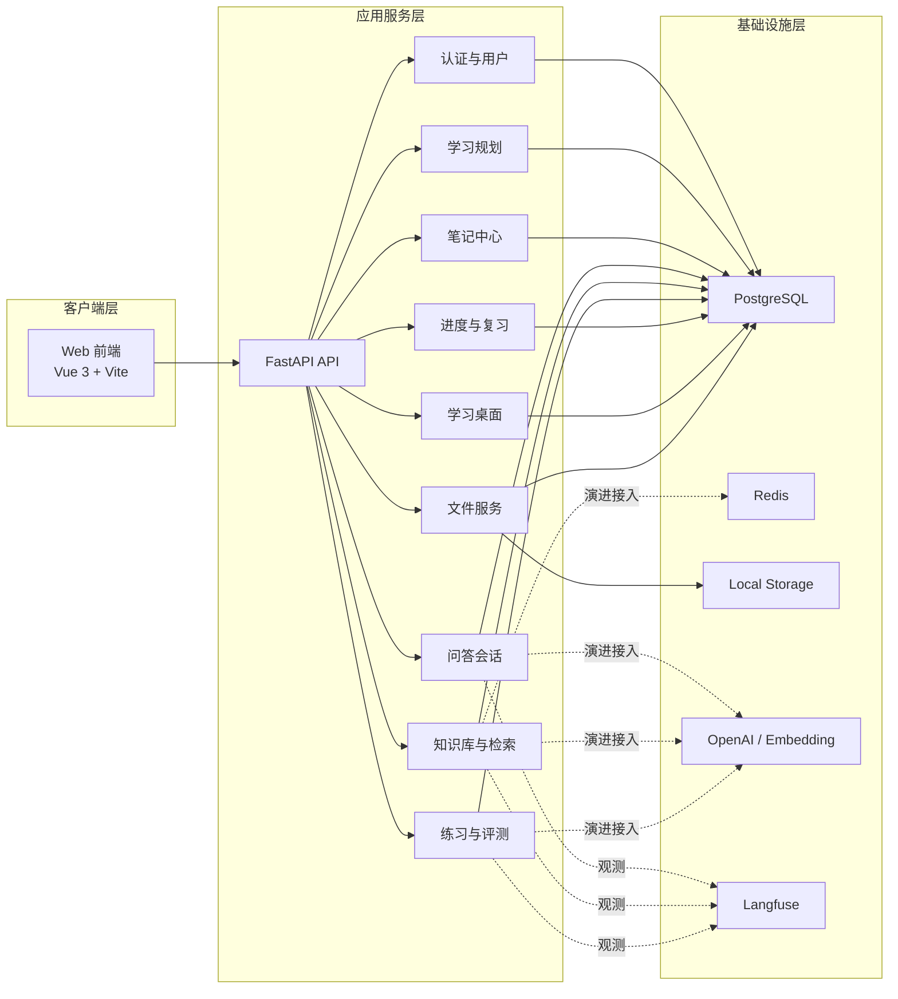
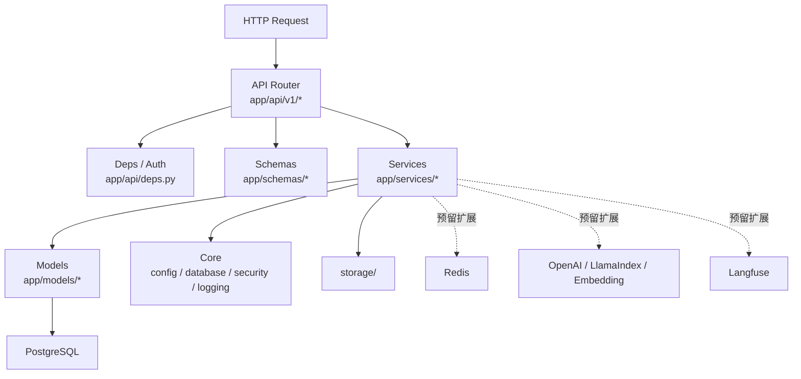
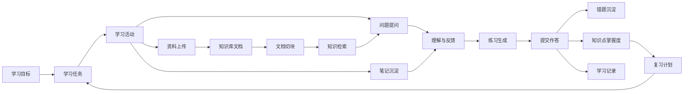
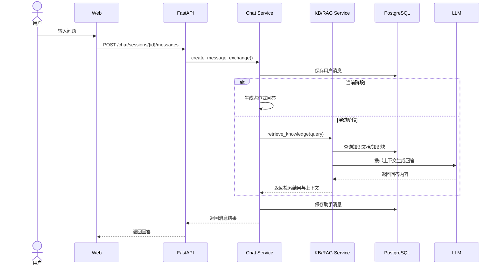
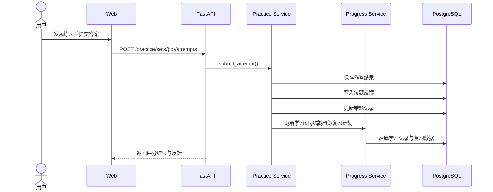
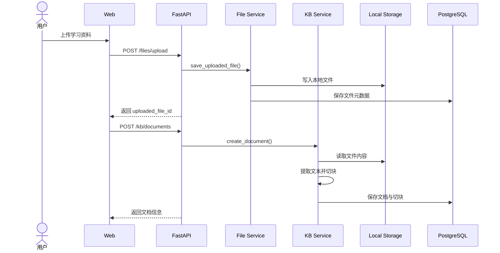
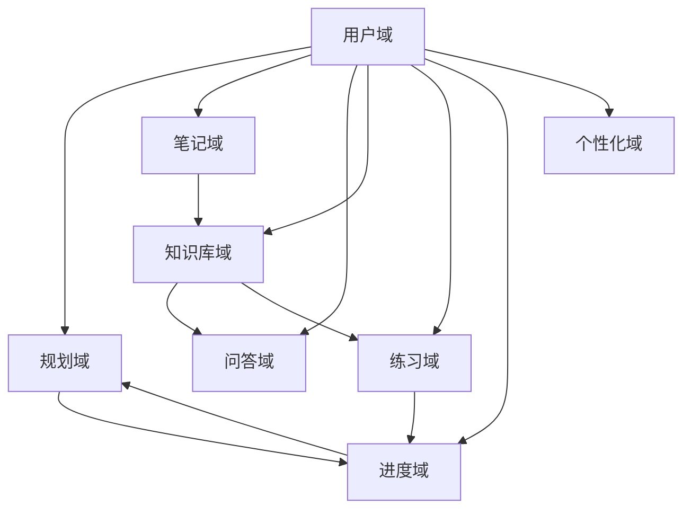
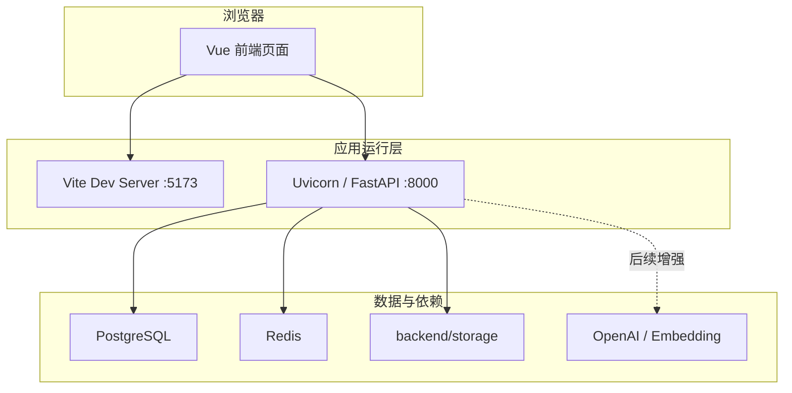
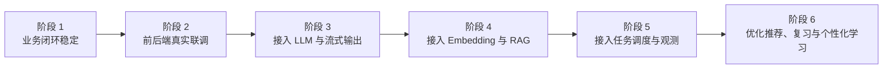

# XueTa 架构设计方案

## 1. 文档目标

本文档用于描述 XueTa 项目的整体架构设计、核心模块划分、关键数据流和后续演进方向。  
项目当前定位为一个面向学习场景的 AI 学习助手，采用前后端分离架构：

- 前端：`Web/`，基于 `Vue 3 + Vite + Vue Router + Pinia + Tailwind CSS`
- 后端：`backend/`，基于 `FastAPI + SQLAlchemy + PostgreSQL`

项目希望围绕“目标规划 -> 资料沉淀 -> 问答辅助 -> 练习评测 -> 进度反馈”形成完整学习闭环，而不是只提供单一问答功能。

## 2. 架构设计目标

### 2.1 业务目标

- 支撑学习规划、笔记、问答、知识库、练习、进度等多个模块协同工作
- 让学习数据能够沉淀、追踪并持续反哺后续学习任务
- 为真实 AI 能力接入预留足够清晰的扩展边界

### 2.2 工程目标

- 以前后端分离提升可维护性和迭代效率
- 以后端分层设计降低业务复杂度
- 以统一数据模型支撑跨模块联动
- 先打通业务闭环，再逐步增强 AI 能力

## 3. 总体架构

### 3.1 架构说明

- 前端负责页面交互、路由切换、用户输入和展示层逻辑
- 后端负责权限控制、业务编排、数据持久化和 AI 能力封装
- PostgreSQL 是当前业务数据主存储
- Local Storage 用于文件上传与知识库原始资料落盘
- Redis、Langfuse、OpenAI、Embedding、RAG 链路是后续持续增强方向

## 4. 代码分层设计

后端采用典型的分层架构，核心目标是把“接口层、业务层、数据层、基础设施层”拆开，避免逻辑全部堆积在路由层中。

### 4.1 各层职责

#### API 层

- 对外暴露 REST 接口
- 处理参数校验、依赖注入、鉴权和响应返回
- 当前主要模块位于 `backend/app/api/v1/`

#### Schema 层

- 定义请求体和响应体结构
- 统一约束模块之间的数据边界
- 降低前后端联调时的歧义

#### Service 层

- 封装核心业务逻辑
- 负责跨模块编排，例如练习结果反哺进度
- 未来也是 AI 链路的主要承载层

#### Model 层

- 使用 SQLAlchemy 定义 ORM 模型
- 统一管理表结构、关系和持久化对象

#### Core 层

- 提供配置、数据库连接、安全、异常处理、日志等基础能力
- 为整个项目提供统一运行环境

## 5. 业务领域架构

XueTa 的设计重点并不是单个页面，而是学习闭环中各业务对象之间的关系。

### 5.1 业务闭环解读

- 学习规划模块定义用户的长期目标和短期任务
- 笔记、问答、知识库模块负责支撑学习中的信息获取与沉淀
- 练习模块把知识输入转化为可检验的输出
- 进度模块把作答结果、学习记录和掌握度串联起来，进一步驱动复习计划

这意味着项目设计天然是跨模块联动的，不能把每个模块都视为孤立系统。

## 6. 核心模块设计

### 6.1 认证与用户模块

职责：

- 注册、密码登录、验证码登录
- Access Token / Refresh Token 生命周期管理
- 当前用户信息查询与资料更新

设计考虑：

- 认证是全局入口，必须先稳定
- Token 机制便于后续前后端分离与多端扩展
- 用户标识是所有业务模块的主关联维度

### 6.2 学习规划模块

职责：

- 学习目标管理
- 学习任务管理
- 学习计划快照生成

设计考虑：

- 目标与任务必须可追踪、可统计、可回流到进度系统
- 当前计划生成逻辑可先规则化实现，后续再替换为 AI 规划

### 6.3 笔记模块

职责：

- 笔记本管理
- 笔记内容管理
- 笔记待办与总结

设计考虑：

- 笔记既是内容沉淀，也是后续知识组织的输入来源
- 后续可以把笔记总结、知识提取接入大模型能力

### 6.4 问答与聊天模块

职责：

- 会话创建与管理
- 用户消息与助手回复持久化
- 消息反馈记录

设计考虑：

- 当前实现以会话和消息结构稳定为优先
- 回答生成目前仍是占位式逻辑
- 后续可升级为 RAG + 大模型 + 流式输出

### 6.5 知识库模块

职责：

- 知识库管理
- 文档管理
- 文档切块
- 检索接口

设计考虑：

- 当前实现已经打通“上传/录入 -> 切块 -> 检索”的基础链路
- 当前检索主要基于关键词匹配
- 后续演进重点是 Embedding、向量检索、召回重排和引用展示

### 6.6 练习与评测模块

职责：

- 练习集生成
- 作答提交
- 自动评分
- 错题沉淀

设计考虑：

- 当前以规则式生成和评分先打通闭环
- 后续可以逐步引入更强的 AI 出题、解析与评分策略

### 6.7 进度与复习模块

职责：

- 学习记录
- 知识掌握度
- 复习计划
- 学习概览统计

设计考虑：

- 这是学习闭环中最体现产品价值的模块之一
- 需要把练习和学习行为统一转成结构化数据

### 6.8 文件与桌面模块

职责：

- 上传文件存储、下载与删除
- 学习桌面布局保存

设计考虑：

- 文件服务支撑知识库和资料管理
- 学习桌面强调个性化与一站式学习入口

## 7. 关键交互流程

### 7.1 问答与知识检索流程

说明：

- 当前代码中聊天模块已支持会话与消息落库
- 后续可以在不改变消息结构的前提下，把回复生成逻辑升级为完整 AI 链路

### 7.2 练习评测与进度回流流程

说明：

- 当前练习模块并不仅仅返回一个分数
- 它还承担了把结果回流到学习分析系统中的职责

### 7.3 文件上传与知识库接入流程

## 8. 数据架构设计

数据库以 PostgreSQL 为中心，表结构大致可按以下领域分组：

- 用户与认证：`users`、`user_profiles`、`refresh_tokens`、`verification_codes`
- 学习规划：`study_goals`、`study_tasks`、`study_plan_snapshots`
- 笔记：`notebooks`、`notes`、`note_todos`、`note_summaries`
- 问答与知识库：`chat_sessions`、`chat_messages`、`knowledge_bases`、`knowledge_documents`、`knowledge_chunks`
- 练习与进度：`practice_sets`、`practice_items`、`practice_attempts`、`wrong_questions`、`learning_records`、`knowledge_mastery`、`review_schedules`
- 个性化与文件：`desktop_layouts`、`uploaded_files`

### 8.1 数据设计原则

- 按学习场景组织领域模型，而不是只按技术模块拆表
- 用户 ID 作为主要业务隔离维度
- 知识、练习、进度之间保留关联关系，方便后续统计与推荐
- 向量检索能力以后续增量方式接入，而不是一开始强耦合

## 9. 安全与边界设计

### 9.1 认证与权限

- 所有核心业务接口通过 Bearer Token 保护
- Refresh Token 独立存储，支持失效与轮转
- 用户只能访问自己的目标、笔记、会话、知识库、文件和布局数据

### 9.2 文件安全

- 文件按用户目录隔离存储
- 文件读取前会校验路径是否越界
- 元数据与物理文件路径分离管理

### 9.3 模块边界

- 路由层不直接承载复杂业务逻辑
- Service 层是跨模块编排的唯一主入口
- AI 调用逻辑应尽量被封装在服务层，而不是散落在控制器中

## 10. 部署与运行视图

说明：

- 当前开发环境下，后端启动时会自动建表
- 当前最小可用依赖是 `PostgreSQL + Local Storage`
- Redis 和 OpenAI 能力可以逐步接入，不会阻塞基础业务开发

## 11. 当前架构现状与演进路线

### 11.1 当前架构现状

| 维度 | 当前状态 |
| --- | --- |
| 前端 | 主要业务页面已接入真实 API，核心学习链路可联调运行 |
| 后端 | 业务模块完整度高，接口、模型、服务层与测试体系已形成可用骨架 |
| 聊天 | 已有会话、消息、反馈持久化与 SSE 流式接口，支持模型与 fallback 双通道 |
| 知识库 | 已有文档抽取、切块、embedding、关键词/向量混合检索 |
| 练习 | 已有生成、评分、错题与进度回流，AI 质量仍有优化空间 |
| 观测与异步 | Redis 队列与 worker 已可运行，Langfuse 已有基础接入，业务异步化仍需深化 |

### 11.2 建议演进路线

建议优先级：

1. 统一编码与文档状态（UTF-8、乱码修复、README/架构文档对齐）
2. 完成前端 token 自动刷新与鉴权重试链路
3. 将 OCR/文档解析/embedding 等重任务迁移到 Redis 队列
4. 强化 RAG 质量（召回重排、引用展示、参数优化）
5. 升级练习生成与评分链路（规则 + 模型混合）
6. 完善 Langfuse 观测、前端测试、E2E 与 CI 发布流程

## 12. 结论

XueTa 当前的架构设计重点不是“把 AI 放进页面里”，而是先把学习场景中的核心对象、业务状态和数据关系搭稳，再逐步把 AI 能力升级进去。

这套架构的优势在于：

- 模块边界比较清晰
- 业务闭环已经具备基础骨架
- 后续 AI 能力增强不会推翻现有系统
- 适合作为课程项目继续深化，也适合作为后续产品化原型继续迭代

如果后续继续完善，本项目最值得投入的方向会是三条主线：

- 前后端全面联调
- 知识库与问答的 RAG 升级
- 练习、掌握度、复习计划的一体化优化
