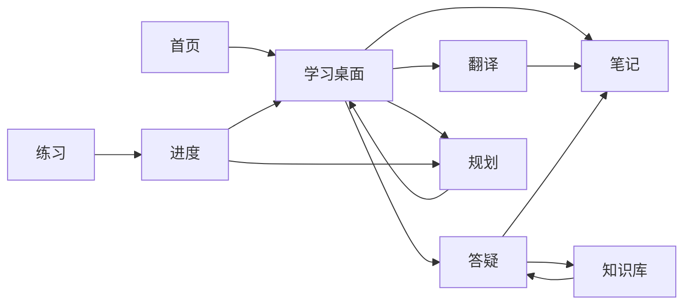

# XueTa 前端页面介绍

## 1. 文档说明

本文档用于介绍 XueTa 项目前端页面的整体组织、路由入口、页面职责、主要交互和后端接口依赖。  
分析范围为 `Web/` 目录，重点覆盖 `Web/src/router/index.js`、`Web/src/App.vue`、`Web/src/views/*`、`Web/src/components/main/*` 和 `Web/src/lib/*`。

项目当前前端采用：

- `Vue 3`：页面与组件开发
- `Vite`：开发服务器与构建工具
- `Vue Router`：单页应用路由
- `Pinia`：状态管理基础设施
- `Tailwind CSS`：页面样式与响应式布局
- 原生 `fetch` 封装：统一 API 请求、鉴权、刷新 Token 与 SSE 流式响应

前端定位不是单一聊天工具，而是面向学习场景的 AI 学习工作台，围绕“资料输入、翻译理解、问答答疑、笔记沉淀、知识库检索、练习评测、进度反馈、学习规划”形成完整学习闭环。

## 2. 前端总体结构

```text
Web/
├── src/
│   ├── App.vue                    # 应用外壳，控制 Header/Footer/全局助手
│   ├── main.js                    # Vue 应用入口
│   ├── router/index.js            # 页面路由配置
│   ├── lib/
│   │   ├── api.js                 # API 请求、Token 刷新、SSE 封装
│   │   ├── auth.js                # 登录态本地存储与事件通知
│   │   └── translate-utils.js     # 翻译保存笔记相关工具
│   ├── components/
│   │   ├── main/                  # 顶栏、页脚、全局 AI 助手、首页启动区
│   │   ├── ui/                    # 按钮、输入框、Tabs 等基础组件
│   │   ├── icons/                 # 业务图标
│   │   ├── auth/                  # 登录注册页交互形象组件
│   │   └── search/                # 桌面搜索组件
│   └── views/                     # 业务页面
└── package.json
```

`App.vue` 是所有页面的统一外壳：

- 根据路由 `meta.showHeader` 控制是否显示顶部导航
- 根据路由 `meta.showFooter` 控制是否显示页脚
- 挂载全局 `AIAssistant`
- 挂载 `CursorAura` 光标动效
- 提供“跳到主要内容”的可访问性入口

## 3. 路由与页面清单

| 路由 | 页面文件 | 页面名称 | Header | Footer | 主要作用 |
| --- | --- | --- | --- | --- | --- |
| `/` | `views/home.vue` | 首页 | 是 | 是 | 展示产品定位、学习工作流和核心入口 |
| `/desktop` | `views/desktop.vue` | AI 学习桌面 | 是 | 否 | 个性化学习入口、快捷应用、网站快捷方式和信息组件 |
| `/translate` | `views/translate.vue` | 智能翻译 | 是 | 是 | 文本/文件翻译、润色、导出、保存到笔记 |
| `/qa` | `views/qa.vue` | AI 答疑 | 是 | 否 | 会话式问答、SSE 流式回答、引用跳转、收藏到笔记 |
| `/note` | `views/note.vue` | AI 学习笔记 | 是 | 是 | 笔记本、笔记编辑、待办、AI 总结 |
| `/kb` | `views/kb.vue` | 知识库中心 | 是 | 是 | 知识库、文档、切块预览和知识检索 |
| `/practice` | `views/practice.vue` | 练习中心 | 是 | 是 | 练习生成、作答提交、评分反馈和错题沉淀 |
| `/progress` | `views/progress.vue` | 学习进度中心 | 是 | 是 | 学习统计、掌握度、学习记录、复习计划 |
| `/planning` | `views/planning.vue` | AI 学习规划 | 是 | 是 | 学习目标、任务、周计划和 AI 计划生成 |
| `/profile` | `views/profile.vue` | 个人中心 | 是 | 是 | 账号资料、学习画像和登出 |
| `/about` | `views/about.vue` | 关于页面 | 是 | 是 | 介绍产品理念、模块价值和学习工作流 |
| `/auth/login` | `views/auth/login.vue` | 登录 | 否 | 否 | 密码登录、验证码登录 |
| `/auth/register` | `views/auth/register.vue` | 注册 | 否 | 否 | 新用户注册并进入桌面 |
| `/auth/resetPassword` | `views/auth/reset-password.vue` | 重置密码 | 否 | 否 | 忘记密码、设置新密码 |

## 4. 公共交互与基础能力

### 4.1 顶部导航

`components/main/header.vue` 提供全局导航，当前包含：

- 首页
- 翻译
- 答疑
- 笔记
- 知识库
- 练习
- 进度
- 桌面
- 规划

顶部导航会读取本地登录态：

- 已登录时展示用户入口和退出按钮
- 未登录时展示登录、注册按钮
- 退出时调用 `/auth/logout`，随后清理本地 Token 并跳转登录页

### 4.2 页脚

`components/main/footer.vue` 用于常规页面底部展示，提供功能入口、资源入口和联系信息。答疑页、桌面页、认证页关闭页脚，以保证核心工作区有更完整的纵向空间。

### 4.3 全局 AI 助手

`components/main/AIAssistant.vue` 是悬浮在页面右下角的全局会话入口。

主要能力：

- 登录后自动接入后端聊天接口
- 使用 `/chat/sessions` 创建或恢复“全局 AI 助手”会话
- 使用 `/chat/sessions/{id}/messages` 拉取历史消息
- 使用 `/chat/sessions/{id}/messages/stream` 获取 SSE 流式回答
- 会话 ID 存入 `localStorage`，刷新页面后可恢复
- 未登录时展示登录提示，并引导进入登录页

### 4.4 API 与认证封装

`lib/api.js` 统一处理前端请求：

- 默认 API 根地址为 `http://127.0.0.1:8000/api/v1`
- 可通过 `VITE_API_BASE_URL` 覆盖
- 自动添加 Bearer Token
- 遇到 `401` 时尝试调用 `/auth/refresh` 刷新 Token 后重试
- 支持普通 JSON 请求、原始响应下载和 SSE 流式请求

`lib/auth.js` 负责登录态：

- `xueta_access_token`
- `xueta_refresh_token`
- `xueta_current_user`
- `xueta-auth-session-change` 自定义事件

## 5. 主要页面介绍

### 5.1 首页 `/`

首页是产品入口页，强调“学习工作流”而不是简单功能列表。

页面内容：

- 顶部大标题“学塔”
- 核心价值描述：资料进入、问题处理、笔记沉淀、练习复盘、任务重排
- 快捷入口：学习桌面、AI 答疑、翻译、笔记、规划
- 学习流程展示：导入资料、理解与提问、整理与练习、计划下一轮
- 模块价值卡片：资料处理、答案溯源、笔记沉淀、数据驱动计划
- 轮播式重点能力展示

该页面主要负责引导和介绍，当前不依赖后端接口。

### 5.2 AI 学习桌面 `/desktop`

桌面页是登录后推荐进入的主工作区，相当于学习系统的控制台。

主要能力：

- 展示应用快捷入口：翻译工坊、学习笔记、学习规划、答疑中心
- 展示网站快捷方式：DeepSeek、GitHub、知乎、哔哩哔哩、有道翻译等
- 展示桌面组件：倒计时、最近笔记、AI Hub、应用文件夹、学习概览、日历等
- 支持拖拽调整桌面项目顺序
- 支持添加网站快捷方式和桌面组件
- 登录用户的布局同步到云端
- 未登录用户的布局保存到浏览器本地

后端接口：

- `GET /desktop/layout?name=default`
- `PUT /desktop/layout`
- `GET /planner/goals`
- `GET /notes`
- `GET /progress/overview`

桌面会用目标、笔记、进度数据增强组件内容，例如最近目标倒计时、最近笔记、学习时长和待复习数量。

### 5.3 智能翻译 `/translate`

翻译页用于处理学习资料中的外文内容，也连接了文件服务和笔记系统。

主要能力：

- 支持文本输入翻译
- 支持上传文件并选中文件作为翻译来源
- 支持文件列表搜索、筛选、下载、删除
- 支持选择源语言、目标语言和翻译模式
- 支持译文润色
- 支持导出译文为文本文件
- 支持将翻译结果保存到笔记本

页面展示的翻译类型包括：

- 文档翻译
- 图片翻译
- 语音翻译
- 网页翻译

当前代码中，核心可用链路是文本/文件翻译、润色、文件管理和保存到笔记。图片、语音、网页入口已在页面上表达，但具体能力取决于后端内容抽取和翻译服务支持。

后端接口：

- `GET /files`
- `POST /files/upload`
- `GET /files/{id}/download`
- `DELETE /files/{id}`
- `POST /translate/text`
- `POST /translate/polish`
- `GET /notes/notebooks`
- `POST /notes/notebooks`
- `POST /notes`

### 5.4 AI 答疑 `/qa`

答疑页是项目中最完整的会话型页面之一，承担用户与 AI 学习助手的深度问答。

主要能力：

- 会话列表与会话分组
- 新建会话、切换会话、删除会话
- 加载历史消息
- 输入问题并通过 SSE 接收流式回答
- 展示 AI 回答中的知识库引用
- 支持跳转到知识库文档或具体切块
- 支持朗读最新回答
- 支持把问答内容收藏到“AI问答收藏”笔记本
- 支持 Markdown 渲染、代码块复制、列表、表格、引用等回答格式
- 支持桌面端侧栏折叠和移动端侧栏开关

后端接口：

- `GET /chat/sessions`
- `POST /chat/sessions`
- `GET /chat/sessions/{id}/messages`
- `DELETE /chat/sessions/{id}`
- `POST /chat/sessions/{id}/messages/stream`
- `GET /progress/overview`
- `GET /notes/notebooks`
- `POST /notes/notebooks`
- `POST /notes`

与其他页面的联动：

- 引用来源可跳转到 `/kb?documentId=...&chunkId=...`
- 收藏回答会写入笔记模块
- 问答统计会读取进度概览

### 5.5 AI 学习笔记 `/note`

笔记页用于沉淀学习内容，是翻译、问答和复习链路的承接页面。

主要能力：

- 加载笔记本列表
- 按笔记本加载笔记列表
- 新建空白笔记，必要时自动创建默认笔记本
- 编辑笔记标题和 Markdown 正文
- 编辑内容自动保存到后端
- 加载和维护与笔记相关的待办
- 生成或更新 AI 学习小结
- 展示笔记结构预览区域

后端接口：

- `GET /notes/notebooks`
- `POST /notes/notebooks`
- `GET /notes?notebook_id=...`
- `GET /notes/{id}`
- `PATCH /notes/{id}`
- `POST /notes`
- `GET /notes/{id}/todos`
- `POST /notes/{id}/todos`
- `PATCH /notes/todos/{id}`
- `POST /notes/{id}/summarize`

页面设计上，左侧偏“组织与任务”，右侧偏“编辑与总结”，适合长期沉淀课程内容、问答收藏和翻译资料。

### 5.6 知识库中心 `/kb`

知识库页用于管理结构化学习资料，并为答疑页提供可引用来源。

主要能力：

- 创建知识库
- 查看知识库列表
- 删除知识库
- 查看当前知识库下的文档列表
- 搜索当前知识库文档
- 手动录入文档正文
- 支持网页地址作为文档来源
- 文档创建后自动切块
- 查看文档切块预览
- 输入问题或关键词进行知识检索
- 支持通过路由 query 定位指定知识库、文档或切块

后端接口：

- `GET /kb/bases`
- `POST /kb/bases`
- `DELETE /kb/bases/{id}`
- `GET /kb/documents`
- `POST /kb/documents`
- `GET /kb/documents/{id}`
- `DELETE /kb/documents/{id}`
- `GET /kb/documents/{id}/chunks`
- `POST /kb/retrieve`

与答疑页联动：

- 答疑页的引用可跳转到知识库页
- 知识库页通过 `documentId` 和 `chunkId` 定位来源内容
- 后续 RAG 能力的主要前端展示入口也在该页面

### 5.7 练习中心 `/practice`

练习页把学习输入转化为可评测输出，是学习闭环中的检验环节。

主要能力：

- 根据标题、学科、知识点、题量、难度、题型生成练习集
- 查看练习集列表
- 选择练习集并加载题目详情
- 支持单选、多选、填空、简答、代码类题目作答
- 提交作答并查看评分结果
- 展示每题反馈
- 查看最近提交记录
- 自动汇总错题沉淀

后端接口：

- `GET /practice/sets`
- `GET /practice/sets/{id}`
- `GET /practice/sets/{id}/attempts`
- `POST /practice/generate`
- `POST /practice/sets/{id}/attempts`
- `GET /practice/wrong-questions`

与进度模块联动：

- 提交练习后，后端会将结果沉淀为错题、掌握度和学习记录
- 进度页可以继续展示练习产生的统计结果

### 5.8 学习进度中心 `/progress`

进度页负责把学习行为、练习结果和复习计划以数据形式展示出来。

主要能力：

- 展示学习记录总数
- 展示累计学习时长
- 展示平均掌握度
- 展示待复习任务数
- 展示学科分布
- 手动添加学习记录
- 展示知识掌握度列表
- 添加复习提醒
- 展示最近学习记录
- 更新复习计划状态：完成、待办、跳过

后端接口：

- `GET /progress/overview`
- `GET /progress/mastery?limit=8`
- `GET /progress/reviews?limit=12`
- `POST /progress/records`
- `POST /progress/reviews`
- `PATCH /progress/reviews/{id}`

该页面是学习闭环的数据出口，能够反向影响规划页和桌面页展示。

### 5.9 AI 学习规划 `/planning`

规划页用于管理学习目标、学习任务和周计划。

主要能力：

- 展示学习目标列表和目标进度
- 展示任务总数、完成率、今日任务、学习时长等统计
- 以周视图展示每日任务
- 支持上一周、下一周切换
- 支持新建目标
- 支持添加任务
- 支持任务关联目标
- 支持设置任务日期、时间、时长和优先级
- 支持点击任务切换完成状态
- 支持按“全部、待完成、已完成”筛选任务
- 支持 AI 生成未来 7 天学习计划，并写入任务列表

后端接口：

- `GET /planner/goals`
- `POST /planner/goals`
- `GET /planner/tasks`
- `POST /planner/tasks`
- `PATCH /planner/tasks/{id}/status`
- `POST /planner/generate`

该页面与进度、练习、桌面存在天然联动：目标会影响桌面倒计时，任务完成情况会进入学习计划统计，练习和掌握度数据也可反向影响后续规划。

### 5.10 个人中心 `/profile`

个人中心用于管理账号信息和学习画像。

主要能力：

- 展示用户名、邮箱、手机号、账号状态和账号 ID
- 展示邮箱验证和手机验证状态
- 编辑显示名称、头像链接、年级、目标考试、偏好学科、学习风格、个人简介
- 保存学习画像
- 更新本地缓存中的用户信息
- 支持退出登录

后端接口：

- `GET /users/me`
- `PATCH /users/me`
- `POST /auth/logout`

学习画像是后续 AI 规划、练习推荐和内容生成的重要上下文来源。

### 5.11 关于页面 `/about`

关于页用于解释产品理念和模块价值。

页面内容：

- 学塔是一套学习工作流
- 核心原则：任务优先、来源可追溯、渐进沉淀
- 功能模块介绍：智能翻译、AI 答疑、笔记整理、学习规划
- 产品能力表达：AI 辅助、一体化、可追踪
- 进入产品的引导入口

该页面主要用于产品说明，不依赖后端接口。

## 6. 认证页面介绍

### 6.1 登录 `/auth/login`

登录页支持两种登录方式：

- 密码登录
- 手机验证码登录

主要能力：

- 密码登录调用 `/auth/login/password`
- 验证码登录调用 `/auth/login/code`
- 获取验证码调用 `/auth/code/send`
- 登录成功后保存 access token、refresh token 和用户信息
- 登录成功后跳转 `/desktop`
- 页面包含登录交互形象组件 `LoginMascotScene`

### 6.2 注册 `/auth/register`

注册页用于新用户创建账号。

主要能力：

- 填写用户名、邮箱、手机号、密码、确认密码
- 前端校验用户名长度、联系方式、密码长度和两次密码一致性
- 必须同意服务条款与隐私政策
- 注册调用 `/auth/register`
- 注册成功后保存登录态并跳转 `/desktop`

### 6.3 重置密码 `/auth/resetPassword`

重置密码页包含两个模式：

- 请求重置：填写邮箱，调用 `/auth/password/forgot`
- 设置新密码：使用 URL 中的 `token` 或开发环境返回的 `reset_token`，调用 `/auth/password/reset`

重置成功后会自动返回登录页。

## 7. 页面之间的业务联动

XueTa 前端的页面不是孤立模块，而是围绕学习数据流串联：



典型路径：

1. 用户在规划页创建目标和任务
2. 在翻译页处理资料，并把结果保存为笔记
3. 在知识库页录入资料，形成可检索知识块
4. 在答疑页基于知识库进行提问，并收藏高价值回答
5. 在练习页生成题目、提交答案、获得反馈
6. 在进度页查看掌握度、复习安排和学习记录
7. 桌面页聚合目标、笔记和进度，成为下一轮学习入口

## 8. 当前前端完成度判断

从代码实现看，前端已经具备较完整的可联调状态：

- 路由覆盖完整
- 主要业务页面均接入真实后端 API
- 登录态持久化和 Token 刷新逻辑已存在
- 问答页和全局助手已支持 SSE 流式响应
- 翻译、笔记、知识库、练习、进度、规划形成了学习闭环
- 桌面页已支持本地和云端布局保存

仍可继续增强的方向：

- 增加页面级自动化测试和端到端测试
- 强化移动端复杂页面的交互体验
- 统一部分页面的空状态、加载状态和错误提示样式
- 增强知识库引用高亮、检索重排和来源可信度展示
- 将更多重任务状态展示到前端，例如文档解析、OCR、Embedding 任务进度
- 补充全局权限守卫，减少未登录用户进入业务页后才看到提示的情况

## 9. 总结

XueTa 前端当前已经从静态页面原型发展为可运行的学习工作台。  
页面层面覆盖了学习系统的主要业务动作：登录、资料处理、问答、笔记、知识库、练习、进度、规划和个人画像。  

它的核心价值在于页面之间的数据可以互相流转：翻译和问答可以沉淀到笔记，知识库可以支撑答疑，练习结果可以回流到进度，进度和目标又能影响桌面和规划。后续优化重点应放在体验一致性、测试覆盖、AI 结果质量和异步任务可视化上。
