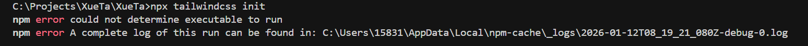

安装tailwindcss
按照官网的教程
通过 npm 安装 tailwindcss，然后创建你自己的 create your tailwind.config.js 配置文件。
```
    npm install -D tailwindcss
    npx tailwindcss init
```
执行第二步的时候发生报错


从日志可以看出，问题出在 Tailwind CSS v4.1.18 上。Tailwind CSS v4 是实验性版本，与 v3 的安装和使用方式不同，不再有 tailwindcss init 命令。

解决方案：
方案1：使用 Tailwind CSS v3（推荐）
这是稳定版本，有完整的 CLI 工具：

bash
# 卸载 v4
npm uninstall tailwindcss

# 安装 v3 稳定版
npm install -D tailwindcss@^3 postcss autoprefixer

# 初始化配置文件
npx tailwindcss init -p